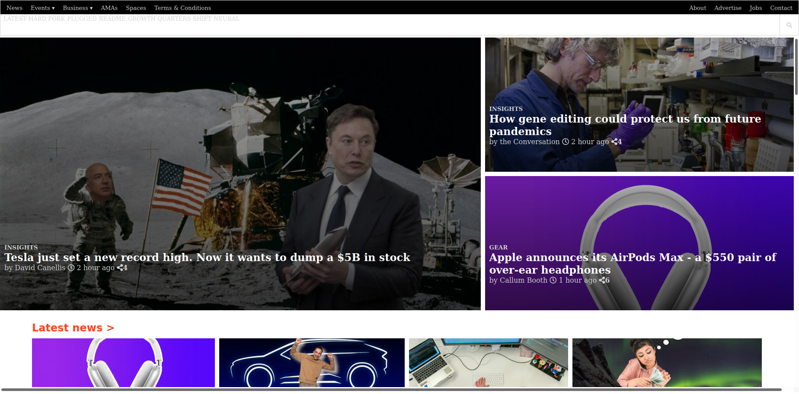

# THE NEXT WEB-CLone
This project is a clone of a thenextweb.com website. The page is responsive

# Getting started :
This website has been designed for a screen size of 1920 X 1080 in Mozilla Firefox browser.
You can also download the repo and open the "index.html" file with Mozilla Firefox.

The purpose of these project is to create a similar looking website to thenexweb.com using HTML and CSS.

## BUILT WITH

    -HTML
    -CSS

## LIVE DEMO

[Live Demo Link](https://widzthedvloper.github.io/TNW-C/)

##  AUTHORS

👤 **Widzmarc Jean Nesly Phelle**

- GitHub: [@githubhandle](https://github.com/widzthedvloper)
- Twitter: [@twitterhandle](https://twitter.com/widzthedvloper)
- LinkedIn: [LinkedIn](https://www.linkedin.com/in/widzmarc-jean-nesly-phelle-252a26129/)

👤 **Denis Lafontant**

- GitHub: [@icebox827](https://github.com/icebox827)
- Twitter: [@heracles2k5](https://twitter.com/@heracles2k5)
- LinkedIn: [LinkedIn](https://www.linkedin.com/in/denis-lafontant-37031439/)

## SHOW YOUR SUPPORT
Give a :star: if you like this project.

## 📝 LICENSE
MIT
